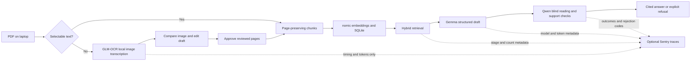

# CiteTutor recording and submission guide

Record a roughly **three-minute screen demo**, then embed/link it in the DEV post. This is a recording guide, not a completed video. The [official submission template](https://dev.to/challenges/hacktoberfest-weekend-2026-10-01) asks for a deployed link or video demo; the post also explains the project, friend, code and open innovation. The Sentry category specifically asks for traces/screenshots and what they helped you discover. A local app can be demonstrated by video without hosting anyone's notes.

Use the original public fixture `eval/sample.pdf` for the main answer/quiz demonstration. For scans, use a publicly shareable image/PDF or get the document owner's permission before putting their notes in the recording. The complete private college lecture PDF is not a repository demo asset.

## What each component actually does

| Component | Show on screen | Accurate explanation |
|---|---|---|
| Gemma 3 4B | A cited explanation and a generated quiz question; generator model tag in health/traces | Locally drafts structured answers and questions from retrieved text. |
| Qwen 2.5 3B | Verifier `Solve` and `Verdict` spans, verified counts | A different model family reads source evidence blindly, then checks agreement/support. |
| nomic-embed-text | Embeddings span and retrieved-count metadata | Local embeddings help retrieve relevant document chunks. |
| GLM-OCR q8 | Original scan beside editable draft; OCR model span | Reads page images locally. Drafts require review before becoming evidence. |
| Sentry Agent Tracing | Actual span waterfall, token counts, outcomes/rejections | Measures the pipeline. It does not read images or decide whether an answer is correct. |



The image and recognized text follow the local path. Sentry gets allowed model labels, timestamps, numeric counts, outcomes, random trace IDs and fixed rejection codes. It does not get PDF files, image/base64 bodies, note text, questions, answers, filenames or verifier free text. Its server still sees connection metadata such as the sender's IP address. Leave the DSN blank for fully local operation; don't show `.env` in the video.

## Prepare the recording

1. Start `./run.sh`, open http://127.0.0.1:8000, and create a separate **Demo / Mechanics** subject. Upload `eval/sample.pdf`. This keeps unrelated probability notes out of the demonstration.
2. Select **sample.pdf** in Study together. Prepare the exact supported/out-of-scope prompts below. Rehearse once and record the actual outputs, rather than promising a particular random quiz count.
3. Keep Sentry open in another tab. Choose the real project and a recent time range. Record Traces/Agents, not the DSN/onboarding screen.
4. Allow real laptop inference time. The latest fixture's returned-answer median was 44.5 seconds. You may shorten waits in the edit, with an on-screen label such as **“Inference wait shortened; actual request 44 s”**, using the actual duration of the recorded request. Keep the request, verification state and resulting answer from the same run.
5. Use a readable browser window and record at 1080p or higher. Close unrelated tabs/notifications in the recording area. Native screenshot/video capture is sufficient; no additional AI partner is required.

## Three-minute shot list

| Time | Action to record | What the viewer learns |
|---|---|---|
| 0:00–0:20 | Library with a demo subject and public PDF | The college-study problem and intended friend. |
| 0:20–0:35 | Model connection panel or `/api/health` | Gemma/Qwen/nomic/GLM are installed local weights; no cloud fallback. |
| 0:35–1:05 | Submit supported prompt; show verification wait and answer | Gemma produces a useful result, and verification precedes display. |
| 1:05–1:20 | Click the page citation and show source text | The explanation is checkable against a physical page. |
| 1:20–1:40 | Generate mixed practice questions on pages 1–3; show actual counts and quote | Questions pass source and blind-solve checks before display. |
| 1:40–1:55 | Submit out-of-scope prompt; show explicit refusal | Missing evidence does not become a confident answer. |
| 1:55–2:20 | Show a publicly shareable scan, editable OCR draft and pending-review status | Image transcription is separate from tutoring and needs correction. |
| 2:20–2:50 | Sentry waterfall; open Gemma and verifier span details; optionally OCR trace | Real latency, tokens, verification stages, and content exclusion. |
| 2:50–3:00 | Latest evaluation summary and repository link | Measured small-fixture results and inspectable implementation. |

Supported prompt:

> What is the net force on a 2 kg body accelerating at 4 m/s²? Give the value and unit.

Expected source fact in the original fixture: **8 N, page 1**. Show what the current run actually returns. Do not bypass a refusal to stage a successful result.

Out-of-scope prompt:

> Explain quantum entanglement and Bell's theorem.

Expected outcome for this mechanics fixture: **Not enough evidence in this document**.

Quiz setup: `sample.pdf`, physical pages **1–3**, **2** candidates, both MCQ and short-answer. The latest ten-question run accepted one and rejected one for blind-solver/key disagreement. Another run may differ; show the actual counts. If no live rejection occurs, label the preserved report as an **earlier recorded evaluation**, with its revision/date, rather than presenting it as the current UI run.

Scan setup: every scanned page must be checked and approved. Blank pages are deliberately excluded. A source can show Ready after those exclusions, so inspect page/chunk counts. The live college PDF currently has only page 1 included; use Review again before trying to teach from the other pages. Do not approve unreviewed text just to obtain a successful recording.

## Narration script

“I built CiteTutor to help a friend in college study from their own notes. I wanted explanations they could check against the material, including a clear refusal when the document cannot support an answer.

“Here is an original mechanics PDF. The study models run locally: Gemma generates explanations and quiz drafts, nomic embeddings retrieve relevant chunks, and Qwen is the independent verifier.

“I ask for the force in this worked example. The app retrieves evidence, checks source IDs, asks Qwen to read the source without seeing Gemma's answer, then checks support and agreement. Only a passing answer appears. Clicking its citation opens the actual page text.

“Practice uses the same evidence discipline. Gemma drafts questions with source quotes. A different model solves them without seeing the proposed key or rationale. Disagreement or unsupported keys remove the question, and the UI shows the actual rejected count.

“For a question outside this PDF, the app refuses. That is a useful boundary, not a promise that these small models never make mistakes.

“Scans use a separate local model, GLM-OCR. Original images sit beside editable drafts. OCR can misread symbols and omit lines, so review comes before indexing. The factual verifier checks reviewed text; it cannot repair an unnoticed transcription error.

“Sentry makes those operations visible. These are real model spans with latency, token counts and fixed rejection codes. It helped us see slow generation and the cost of repeated rejected drafts. Sentry receives metadata only: no images, prompts, answers or source text. Inference stays local, and tracing can be turned off.

“The latest small mechanics evaluation answered seven supported questions with expected-page citations and refused three unrelated questions. One quiz candidate passed; one was rejected. Earlier failures remain in the repository. Open weights make the study pipeline private after setup, avoid paid inference APIs and let us swap models for different laptops.”

Adapt wording to the actual recorded output. Use only the author-reported friend feedback: useful, but a little slow. Do not invent a course identity, learning gain or measured friend-session timing. Universal handwriting accuracy, perfect factual verification, measured local inference cost and a physically tested network disconnection have not been established.

## Sentry screenshots and captions

Actual inspected app and Sentry PNGs are now saved in the [screenshot gallery](demo/README.md) and embedded in `submission.md`. For the video, use the same evidence requirements:

| Capture | Required visible evidence | Suggested caption |
|---|---|---|
| Tutor waterfall | Retrieval, embeddings, Gemma `Draft`/`NumericalDraft`, Qwen `Solve` and `Verdict`, actual timings | “Local generation and independent source verification, traced stage by stage.” |
| Gemma span | `gen_ai.request.model=gemma3:4b`, token counts and duration | “Gemma performs the central drafting work; counts come from Ollama.” |
| Privacy view | Span input/output absent, while token/timing fields remain | “Content capture is disabled; Sentry receives allowed metadata.” |
| Rejection or refusal | Actual rejection code/attempt count, or recorded evaluation clearly labelled | “The gate rejected this candidate/draft; the UI did not show unverified text.” |
| OCR span | `CiteTutor ocr`, `Ollama page transcription`, model `glm-ocr:q8_0`, real tokens/duration | “Image recognition happens on the laptop; image content is excluded from telemetry.” |

The preserved live trace `66ca5eb26d1a46708f0497e55d9757ff` predates the new tutor blind-reading step; it shows the earlier Gemma/Verdict pipeline. Its sanitized delivery record is `eval/traces/live-delivery.json`. Label that capture correctly or generate a current trace.

A fresh real-model OCR SDK preview is preserved in [ocr-preview.json](../eval/traces/ocr-preview.json): 4,072 input tokens, 87 output tokens, 60.18 seconds total, with no image/text/filename in the envelope. It uses the credited public glassboard photo. This preview was captured locally and is not proof of live Sentry ingestion or a dashboard screenshot.

Live OCR ingestion was also inspected in Sentry Traces and Agents: trace `9dd839e0c7304be8b77640221506af80`, 59.09 s root / 59.07 s model, 4,072 input / 87 output tokens. Agent Activity shows the local OCR model and **No input for this span**. The actual dashboard screenshot is now saved as [sentry-ocr-privacy.png](demo/sentry-ocr-privacy.png), captured on October 5. The verified metadata and account-gated trace URL are in [ocr-live.json](../eval/traces/ocr-live.json). The public PNG lets judges inspect the capture without Sentry account access.

Current tutor evidence is also verified live in [current-tutor-live.json](../eval/traces/current-tutor-live.json). The supported sample request (`08998f10d6f341e9a9a95454c5de60ba`) passed on attempt one in **45.73 s**. Gemma's NumericalDraft took 24.84 s (1,215 input / 79 output tokens), followed by Qwen blind Solve in 9.68 s and support checking in 10.80 s. The input panel contains no model content. The outside-worked-evidence request (`e67e9be1c0db41d2b5fba5d2f9e24ae6`) refused after **three draft rejections**, with a 1.66-minute root. Its first fixed rejection code is `unsupported_quantity`; source guards blocked the drafts before Qwen. Real [Gemma/privacy](demo/sentry-gemma-privacy.png), [rejection](demo/sentry-refusal-waterfall.png) and OCR PNGs were saved on October 5. The dashboard requests are from October 4; video export remains pending.

Rehearse focused stages with real models:

```sh
# Local SDK capture; sends nothing to Sentry:
uv run --offline python -m scripts.trace_demo --preview --case tutor
uv run --offline python -m scripts.trace_demo --preview --case quiz
uv run --offline python -m scripts.trace_demo --preview --case ocr --ocr-image /path/to/public-demo-image.jpg

# With the project DSN configured, omit --preview and inspect the printed trace IDs in Sentry:
uv run --offline python -m scripts.trace_demo --case tutor
uv run --offline python -m scripts.trace_demo --case quiz
uv run --offline python -m scripts.trace_demo --case ocr --ocr-image /path/to/public-demo-image.jpg
```

OCR rehearsal does not approve or index the image, and does not print its text. Tutor/quiz rehearsals use a temporary library with `eval/sample.pdf`. CLI completion and a trace ID alone do not prove dashboard ingestion; inspect the matching actual trace before claiming it. Preview files are sanitized SDK captures, not dashboard screenshots.

For a public photo example, use [Learning Physics](https://commons.wikimedia.org/wiki/File:Learning_Physics.jpg), Preply.com Images / preply.com, [CC BY 2.0](https://creativecommons.org/licenses/by/2.0/). Preserve that credit in the post/video. The actual earlier direct-image check is in `eval/SCAN_RESULTS.md`; it is not a test of diagram interpretation.

## What to submit

The DEV post is the submission. Use the official template, its tags `devchallenge`, `weekendchallenge`, `hf26challenge`, a public repository link, and an accessible demo-video link. List **Best Use of Gemma** and **Best Use of Sentry Agent Tracing**, with evidence of each. Include the screenshots and measured findings, not just partner names. Writing quality is weighted most heavily in the [published judging criteria](https://dev.to/challenges/hacktoberfest-weekend-2026-10-01).

Pending before publishing: record/export the actual video, upload it somewhere judges can watch, replace demo placeholders with its URL and real screenshots, and add friend feedback only if they actually try it. The checked source states the deadline as **October 5, 2026, 06:59 UTC / 12:29 IST**.

The official FAQ says projects and repositories must start during the challenge window. This adaptation contains earlier code; resetting Git history does not change that provenance. Obtain organiser clarification before claiming eligibility and retain the disclosure in the write-up. This guide does not publish the entry or establish eligibility.
