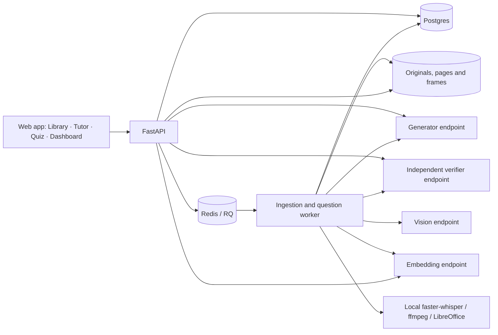

# Architecture — source-grounded multimodal study companion

The target is the complete Track D product in one 15-day release. Team-owned model machines provide inference capacity; hardware on the editor's laptop does not constrain the architecture. This document describes current components and the invariants that the final release must preserve. Validation gaps are explicit in `README.md` and `implementation.md`.

## Runtime



`study/main.py` serves the API and current browser client. Worker processes can run separately with access to the same database, queue and source volume. Each model role can use a different Ollama machine through its role-specific URL. There is no automatic cloud fallback. Generation and verification must use different model-family tags; human audits remain necessary because family separation does not guarantee correctness.

## Data and provenance

The current SQLAlchemy store uses typed record categories with JSON payloads: courses, sources, units, concepts, learners, questions, assessments, attempts, chats and generation jobs. Records have unique `(kind, scope, key)` identities and optimistic versions; critical writes additionally lock rows under Postgres. The release plan calls for normalized migrations and indexed vector/full-text retrieval, preserving IDs.

- Sources carry original filename, hash, course, ingestion status and errors.
- Units carry source ID, content, modality, image reference, concept IDs, embedding and embedding model.
- Page locators use one-based pages and ordered finite bboxes in page coordinates, plus page dimensions. Video locators require `0 <= t0 < t1`.
- Concepts carry topic, definition, prerequisite IDs and the units used to verify each edge. Proposed edges are rejected if they introduce a cycle.
- Approved questions retain the key/rubric, rationale, difficulty prior, source units and verification record on the server.
- Attempts retain the submitted request, result and event key. Learner state stores BKT mastery, graded counts, stability, last graded timestamp and misconception evidence.

Model output is schema-validated. Uploaded content, transcripts, student responses and conversation history are untrusted data, never system instructions. The current deployment is a trusted local workspace; authentication and tenant enforcement are required before any public deployment.

## Ingestion

PDF extraction uses PyMuPDF text blocks and page rendering. Whole-page vision captures embedded/vector diagrams and scanned text, with citations to that page. PPTX rendering uses LibreOffice and extracts notes with python-pptx. Video ingestion uses faster-whisper and ffmpeg frame extraction; units combine timed transcript and an explicitly timestamped frame description.

Extraction checkpoints depend on extractor version, vision model and ASR model. Upload hashing is scoped to the course. The worker persists failure status and supports retry. Source readiness currently depends on extraction, tagging, embedding and prerequisite processing; release work adds measured confidence thresholds and interrupted-job recovery. No source enters retrieval while failed or partially processed.

## Retrieval and grounding

The current retriever computes lexical BM25-style scores and embedding cosine similarity, then uses reciprocal-rank fusion to obtain evidence. All candidates come from the selected course. An embedding-model change is rejected until the course is reingested. Release work moves large-corpus search into indexed storage and adds reranking and dev-set sufficiency calibration.

The generator returns `answerable` and structured segments with exact evidence IDs. The pipeline rejects unknown/missing IDs and asks the independent verifier to check every factual segment against its cited evidence. A failed answer can regenerate up to three drafts; exhausted verification returns a refusal. The client never sees unchecked drafts. Internal support rate is not the same as independently evaluated RAGAS faithfulness.

Ask, explanation and hint modes share this grounding path. Learner state adjusts depth and order. A separate graded teach-back path checks the explanation against evidence and verifies feedback before updating mastery. Unassessed conversation never changes mastery.

## Assessments

Questions support MCQ, short answer and numerical response schemas. The blind solver sees stem/options/evidence without keys, rationales or distractor misconception labels. Source support, key consistency and unambiguous answers are required. Numeric responses currently receive finite-number comparison against an independent model answer; deterministic expression/template verification remains a release gate. Arbitrary generated code must never run in the API or worker process.

The bank records approval results and rejects near-identical stems. A student's answered questions and active-session reservations are excluded. The release adds semantic/template novelty checks. Mixed sessions require sufficient bank coverage per requested type.

Adaptive/diagnostic item selection occurs after the previous attempt commits. Mock mode keeps a fixed ordering. Unanswered payloads expose only stem, option labels/text, type, concept and expected unit. Scoring keys, rubrics and rationale stay server-side. Reports include accuracy, mastery change, misconceptions and source revisit links.

## Learner model

For mastery `p`, guessing `g`, slip `s` and learning transition `T`:

```text
correct posterior   = p(1-s) / [p(1-s) + (1-p)g]
incorrect posterior = ps / [ps + (1-p)(1-g)]
tempered             = p + weight(post - p)
next                 = tempered + (1-tempered)weight*T
```

Validate finite probabilities, `g+s<1` and a possible observation. Zero weight is a no-op. A wrong answer reduces the observation posterior but the subsequent learning transition can raise the final estimate; tests must not assert unconditional final monotonicity.

Effective mastery uses `p * exp(-days_since_graded_evidence/stability_days)`. Reading a page does not reset that clock. Self-ratings initialize unobserved concepts only. No automatic prerequisite mastery propagation is performed. Graded events update state and misconception evidence transactionally and exactly once.

The dashboard shows mastery estimates with evidence counts, not fabricated mastery confidence intervals. The current selection rule prioritizes low effective mastery and moderate challenge, with coverage priority for diagnostic sessions. Its first synthetic evaluation does not establish superiority; calibration is part of the release plan.

## Deployment and verification

Compose provides API, worker, Postgres and persistent Redis, with a shared source volume. Python dependencies are resolved in `uv.lock`. Role-specific inference URLs support distributed hardware; ASR device and compute type are configurable separately.

Tests use SQLite and explicit model doubles to verify extraction/citations, refusal, scope, private answer payloads, grading, idempotency and numerical invariants. They do not prove local-model quality or Postgres concurrency behavior. Final verification includes real model/corpus tests, container execution, browser/accessibility checks, migrations and restart recovery, human question review, RAGAS and synthetic policy comparisons.
