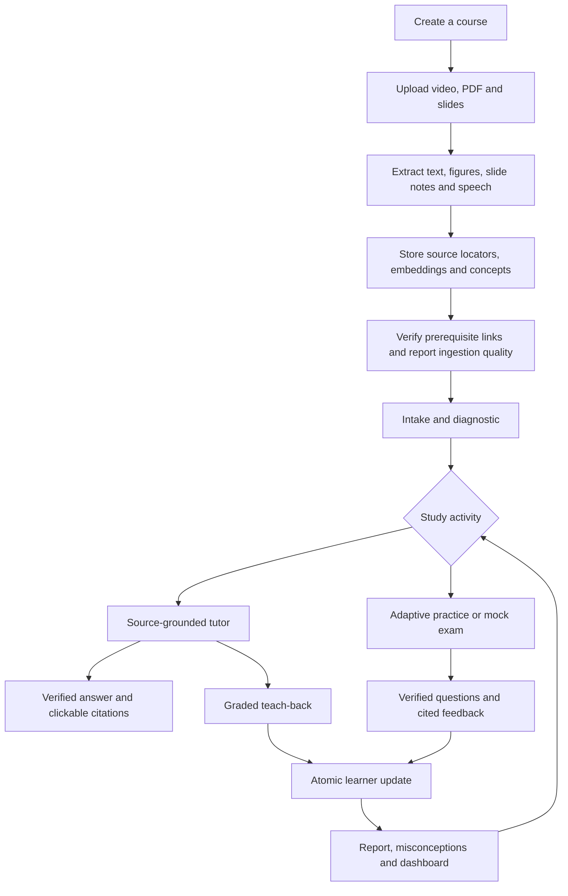

# Workflow — one integrated study companion

**Delivery target: the full application in 15 days.** This is one continuous workflow, not two products or a PDF-only first release. See `implementation.md` for the day-by-day plan and `README.md` for verified implementation status.

## Student journey

## Material processing

1. The API validates the course and file size/type, stores the original and computes a content hash. Duplicate material within the course reuses its source record.
2. RQ sends ingestion to a separate worker. The UI shows queued, extracting, structuring, embedding, ready or failed state.
3. PDFs produce text blocks and rendered page images; vision extracts diagrams/scanned text. PPTX files render through LibreOffice while preserving slide notes. Videos produce timed speech segments and frame descriptions.
4. Every content unit keeps a page/bbox or time interval. Concepts/topics are extracted, embeddings stored and prerequisite candidates independently checked before cycle-free links are saved.
5. Failed sources display an actionable error. Retrying reuses the compatible extraction checkpoint; changed extraction settings invalidate it. Only ready sources participate in tutoring.
6. Release testing must exercise missing tools/models, worker interruption, malformed files, scans, diagram errors and low-confidence transcripts. A successful model call alone is not a quality gate.

## Grounded tutoring

1. Retrieve only the selected course's ready units using lexical and semantic ranks.
2. Load the learner's state; use it to shape the explanation, not as factual evidence.
3. Generate structured answer segments with unit IDs. Unsupported queries are declined.
4. Reject unknown/missing citations. The independent verifier checks factual support against the cited evidence.
5. Retry at most three complete drafts. If no draft passes, decline visibly. Only checked segments reach the client.
6. Citation chips open the original page with its bbox highlighted, or a video at its cited interval.
7. Asking questions and reading explanations do not change mastery. A graded teach-back uses source evidence and an idempotent event ID, then updates the learner transactionally.

The release adds reranking, a calibrated sufficiency gate, conversational quality tests and measured latency. No unverified-token streaming shortcut is permitted.

## Assessments and learner state

1. Choose scope, types, count and session mode. Generate questions asynchronously into a reusable course bank.
2. Validate schema, source IDs and answer format. Blind solving receives no answer key, rationale or distractor labels. Reject disagreements, ambiguity and unsupported keys. Check novelty before approval.
3. Reserve approved unseen candidates for a session. Require enough candidates of each requested type; do not silently change the type mix or repeat old questions.
4. In adaptive/diagnostic sessions, select each next item using the latest committed learner state. Mock sessions use a fixed candidate order.
5. Grade MCQs exactly, numeric answers by finite value/tolerance and units, and short answers with the verified rubric.
6. Commit answer event, mastery and misconception evidence in one transaction. Repeated event IDs return the stored result; conflicting reuse is rejected.
7. Return cited feedback. Finish with a per-concept accuracy/mastery-change report and revisit links. Ended sessions release unused reservations; active sessions can resume.
8. The dashboard ranks weak concepts using decayed mastery and shows evidence counts. Self-ratings are priors, not demonstrated mastery. Accuracy uncertainty must not be labelled as BKT mastery uncertainty.

## Evaluation and release

Build human-checked dev and held-out test sets across all modalities and off-material cases. Tune on dev only. Run local RAGAS judges, citation/refusal metrics and the shared-policy simulator. Log model versions, dataset identity, code revision, dirty-worktree status and failure cases. Review a question sample manually.

Every day, integrate into the same app and verify the complete available journey. Keep changes reviewable, preserve the working demo path, and record blocked acceptance gates. Freeze features on Day 14 and use Day 15 for release blockers and submission. Required multimodal, assessment and evaluation work takes priority over optional enhancements.
